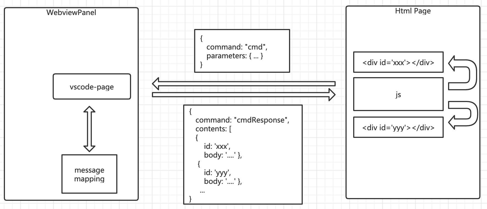

# vscode-page

vscode-page is a light-weight page micro framework for vscode webview. Vs Code Extension developers can use it to finish pages for webviews in their extensions quickly.

## Features

- abstract the communication between htmls and WebviewPanels, developers can focus on business logics.
- built-in template engine, with [handlebars.js](https://www.npmjs.com/package/handlebars).
- message mapping, a simple way to organize your page logic and view.
- baseUrl support, then you can use relative paths in your html page.

## Installing

```
npm install vscode-page
```

## Usage

You can build a vscode webview quickly with the following steps:

1. define messages between your html page and vscode.WebviewPanel.
1. write your html page and js functions used by that page.
1. define MessageMappings.
1. register a command to create (or show) your WebviewPanel with the MessageMappings your defined above.

The whole architecture is shown below:



Also, there is [a demo project](example) to show its usage. Before check it, please read the following first.

### Messaging

As described in vscode extension guide, html and WebviewPanel can pass messages each other. To standardize this communication, vscode-page defines two message formats.

#### js -> WebviewPanel

The Json format of messages from js to WebviewPanel:

- command, a request will be processed by WebviewPanel.
- parameters, a json argument of a handler to process thecommand. It is optional.

Here is an example:

```json
{
  "command": "showExtension",
  "parameters": {
    "repo": repo,
    "extId": extId,
    "installed": installed
  }
}
```

#### js <- WebviewPanel

The json format of messages from WebviewPanel to js:

- command, if it ends with "Response", then it is a response of the prefix. Such as "showExtensionResponse" is the response of "showExtension".
- contents, a content array, it is optional. Each item has following keys:
  - id, element id in a html page.
  - body, innerHtml (generated by the template defined in MessageMappings) of the element pointed by id.
- result, result of the "\${command}" handler, it is optional.

Here is an example:

```json
{
  "command": "showExtensionResponse",
  "contents": [
    {
      "id": "xxx",
      "body": "...."
    },
    {
      "id": "yyy",
      "body": "...."
    }
  ]
}
```

### HTML

In order to initialize correctly, for each html, please insert the following two lines in \<head\>:

```
<base href="{{base}}" />
<script type="text/javascript">
  "{{init}}"
</script>
```

Here is the explaination:

- {{base}} will be replaced by "path.join(context.extensionPath, root)", then you can use relative paths in your html.
- {{init}} will be replaced by a js defining an EventListener to receive the messages from WebviewPanel.

Then you can invoke the initEventListener functions defined in {{init}} to initialize the EventListener receiving messages from WebviewPanel as below:

```javascript
initEventListener();
```

The default implementation of EventListener will only process messages ending with "Response" and use the contents as the innerHtml of the elements selected.

If you want to process other messages, you can pass your function to initEventListener as below:

```javascript
initEventListener(message => {...});
```

The message has following key:

- result, the result of a command handler.

### MessageMappings

A MessageMapping defines:

- command, a command from the message posted by a js function.
- handler, a handler for the command above, its signature is below and the parameters are from the message posted by a js function.

```typescript
(parameters?: any) => Promise<any>;
```

- templates, a template array for the views of response of the command, it is optional. Each item has the following keys:
  - id, an element id in your html.
  - content, a inline handlebars template, it is optional.
  - contentUrl, a url to a external handlebars template, it is optional.
- forward, a command the request flow will go, it is optional.

NOTE:

- "content" and "contentUrl" should not be used both, and one of them must be shown in the definitions.
- "templates" and "forward" should not be used both.

Here is an example: [home.ts](example/src/home.ts)

### createOrShowPage

To create or show a WebviewPanel, you can invoke function createOrShowPage like beblow (from [extension.ts](example/src/extension.ts) in example):

```typescript
createOrShowPage(
  "name",
  "ext.home",
  "Sample Page",
  "pages",
  "home.html",
  context,
  messageMappings
);
```

The signature of createOrShowPage:

```typescript
export function createOrShowPage(
  name: string,
  viewType: string,
  title: string,
  base: string,
  page: string,
  context: vscode.ExtensionContext,
  messageMappings: MesssageMaping[]
);
```

Each argument:

- name, named index of the WebViewPanel you want to create.
- viewType and title, both of them will be passed to vscode.window.createWebviewPanel.
- base, local resource root of html.
- page, html file name.
- context, vscode.ExtensionContext.
- messageMappings, MesssageMaping array you defined, find examples in [home.ts](example/src/home.ts).

## Requirements

vscode-page is a tool for [vscode](https://code.visualstudio.com/) extension development and uses [handlebars.js](https://www.npmjs.com/package/handlebars) as its template engine.

So, please install **vscode** and **handlebars** first.

## Development

For local debugging, please run the following command under the directory of vscode-page project:

```
npm link
```

Then, in the project using vscode-page, please run the following command:

```
npm link vscode-page
```

NOTE:

The linked package in application will use its own node_modules, so if you defined your own handlebars helper in your application, vscode-page can not find it.

```
app
 |- node_modules
     |- vscode-page  <-- project linked by "npm link"
     |   ├─ node_modules
     |   |    |- handlebars.js <-- used by vscode-page
     |
     |- handlebars.js <-- you defined helper in it
```

I can not find an easy way to fix it, only find the following steps. If you have any good idea, please let me know.

- "npm pack" in vscode-page project.
- "npm install local-package" in your application.

## Known Issues

Please visit [issues](https://github.com/DTeam-Top/vscode-page/issues) page to submit new issues or check known issues.

## Release Notes

### 0.0.1

First release.

## License

vscode-page is released under the Apache License 2.0 license.
